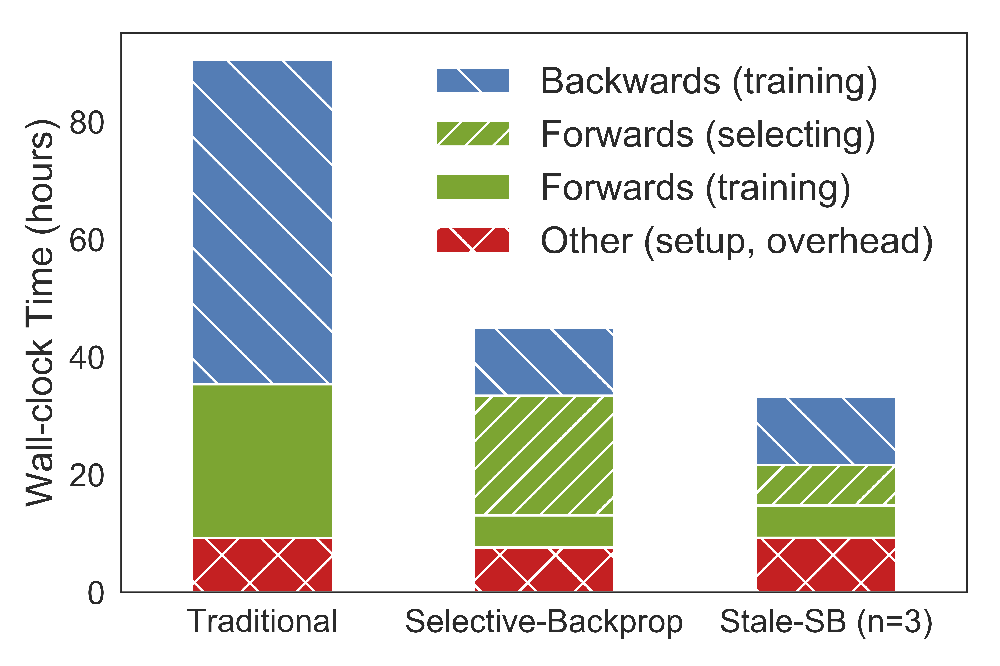

## Accelerating Deep Learning by Focusing on the Biggest Losers

SelectiveBackprop (SB) accelerates training by dynamically prioritizing useful
examples with high loss. As shown in the figure, SelectiveBackprop can reduce
training time by 50% or more by reducing time spent in backpropagation. [Our
paper](https://arxiv.org/abs/1910.00762) describes the system in detail.



## Prerequisites

* Nvidia GPU with CUDA
* PyTorch 0.4.0 or newer
* Numpy

## Example Commands

```bash
# Train using SB
python examples/train.py --strategy sb --dataset <cifar10|cifar100|svhn>

# Train using StaleSB
python examples/train.py --strategy sb --dataset <cifar10|cifar100|svhn> --fp_selector stale
```

## Example Usage

```python
'''
SelectiveBackpropper
   :param cnn: pytorch network
   :param cnn optimizer: pytorch optimizer
   :param prob_pow: integer for beta
   :param batch_size: integer for batch size
   :param lr_sched: string for path to lr schedule or None
   :param num_classes: int for number of classes
   :param num_examples: int for number of training examples
   :param forwardlr: boolean for lr schedule based on epochs
   :param strategy: string in ['nofilter', 'sb']
   :param calculator: string in ['relative', 'random', 'hybrid']
   :param fp_selector: string in ['alwayson', 'stale']
   :param staleness: int for StaleSB
'''

sb = SelectiveBackpropper(cnn,
                          cnn_optimizer,
                          prob_pow,
                          batch_size,
                          lr_sched,
                          num_classes,
                          num_examples,
                          forwardlr,
                          strategy,
                          calculator,
                          fp_selector,
                          staleness)

while True:
    sb.trainer.train(train_loader)
    sb.next_epoch()
    sb.next_partition()

```

